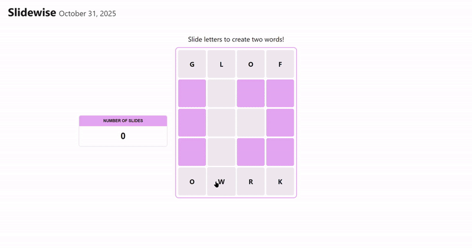

# Slidewise (React | TypeScript)

A sliding-letter puzzle game built with **React + TypeScript + Vite**.  
Players slide letter tiles to form two hidden words!

**Play Now:** [https://mbartolotta345.github.io/Slidewise/](https://mbartolotta345.github.io/Slidewise/)

---

## Overview

**Slidewise** is inspired by word puzzles like *Wordle* and *NYT Connections*!
You start with a 5×4 grid of letter and barrier blocks.

- Select a letter tile, then an empty space to slide it.  
- Rearrange letters to form two valid words (one on the top row and one on the bottom).  
- When both words are correct, the game celebrates your success with a **“Great Job!”** message and freezes the board.

  

---

## Features

- **Dynamic grid logic:** each square tracks state (`empty`, `filled`, `barrier`)  
- **Move counter:** tracks the number of slides with a move counter
- **Win detection:** checks for correct words dynamically
- **Responsive layout:** centered game board, GitHub Pages support
- **Victory screen:** animated “Great Job!” message

---

## Future Iterations

- Add randomized starting boards and difficulties
- Lose condition with limited amount of slide moves you can use  
- Add animations for tile sliding
- Barrier block connection through CSS 
- Add sound effects
